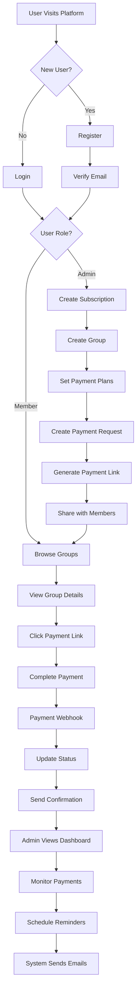

# Complete User Flow - Sublow API

## Overview
This document outlines the complete user journey through the Sublow subscription management platform, from registration to payment collection.

---

## 🎯 User Personas

### 1. **Subscription Admin** (ADMIN/SYSTEM_OWNER)
Creates and manages subscriptions, groups, and collects payments.

### 2. **Group Member** (MEMBER)
Joins groups, makes payments, and tracks their subscription status.

---

## 📋 Complete User Flows

### Flow 1: Admin Creates Subscription & Group

#### Step 1: Register/Login
```http
POST /api/v1/auth/register
Content-Type: application/json

{
  "email": "admin@example.com",
  "password": "SecurePass123!",
  "firstName": "John",
  "lastName": "Doe"
}

Response:
{
  "access_token": "eyJhbGc...",
  "refresh_token": "eyJhbGc..."
}
```

**Alternative: Google OAuth**
```http
GET /api/v1/auth/google
→ Redirects to Google login
→ Returns to /auth/callback with tokens
```

#### Step 2: Create Subscription
```http
POST /api/v1/subscriptions
Authorization: Bearer {access_token}
Content-Type: application/json

{
  "name": "Netflix Premium Sharing",
  "description": "Share Netflix Premium with 4 people",
  "allowedPlans": ["MONTHLY", "QUARTERLY"],
  "currency": "NGN"
}

Response:
{
  "id": "sub_123",
  "name": "Netflix Premium Sharing",
  "allowedPlans": ["MONTHLY", "QUARTERLY"],
  "currency": "NGN",
  "status": "ACTIVE",
  "createdAt": "2025-12-14T16:00:00Z"
}
```

#### Step 3: Create Group with Subscription
```http
POST /api/v1/groups/with-subscription
Authorization: Bearer {access_token}
Content-Type: application/json

{
  "subscriptionDetails": {
    "name": "Netflix Premium Group",
    "description": "4-person Netflix sharing",
    "allowedPlans": ["MONTHLY"],
    "currency": "NGN"
  },
  "groupDetails": {
    "groupName": "Netflix Squad Dec 2025",
    "groupLimit": 4,
    "rules": "Payment due by 1st of each month"
  }
}

Response:
{
  "group": {
    "id": "grp_456",
    "groupName": "Netflix Squad Dec 2025",
    "groupLimit": 4,
    "status": "ACTIVE",
    "subscriptionId": "sub_123"
  },
  "subscription": {
    "id": "sub_123",
    "name": "Netflix Premium Group"
  }
}
```

#### Step 4: Create Payment Request
```http
POST /api/v1/payments/groups/grp_456/payments
Authorization: Bearer {access_token}
Content-Type: application/json

{
  "amount": "2500",
  "description": "December Netflix Payment",
  "dueDate": "2025-12-31T23:59:59Z",
  "paymentPlan": "MONTHLY"
}

Response:
{
  "id": "pay_789",
  "groupId": "grp_456",
  "amount": "2500",
  "description": "December Netflix Payment",
  "dueDate": "2025-12-31T23:59:59Z",
  "status": "PENDING"
}
```

#### Step 5: Get Payment Link
```http
POST /api/v1/payments/initialize/pay_789
Authorization: Bearer {access_token}

Response:
{
  "link": "https://pay.sublow.com/pay_789?amount=2625",
  "breakdown": {
    "baseAmount": 2500,
    "fees": {
      "platformFee": 25,
      "gatewayFee": 100
    },
    "totalAmount": 2625
  }
}
```

#### Step 6: Share Payment Link
Admin shares the payment link with group members via WhatsApp, email, or SMS.

---

### Flow 2: Member Joins & Pays

#### Step 1: Member Registers
```http
POST /api/v1/auth/register
Content-Type: application/json

{
  "email": "member@example.com",
  "password": "MemberPass123!",
  "firstName": "Jane",
  "lastName": "Smith"
}
```

#### Step 2: View Available Groups
```http
GET /api/v1/groups
Authorization: Bearer {member_access_token}

Response:
[
  {
    "id": "grp_456",
    "groupName": "Netflix Squad Dec 2025",
    "groupLimit": 4,
    "status": "ACTIVE",
    "subscription": {
      "name": "Netflix Premium Group"
    }
  }
]
```

#### Step 3: View Group Details
```http
GET /api/v1/groups/grp_456
Authorization: Bearer {member_access_token}

Response:
{
  "id": "grp_456",
  "groupName": "Netflix Squad Dec 2025",
  "groupLimit": 4,
  "status": "ACTIVE",
  "rules": "Payment due by 1st of each month",
  "members": [
    {
      "userId": "user_123",
      "role": "ADMIN"
    }
  ],
  "subscription": {
    "name": "Netflix Premium Group",
    "allowedPlans": ["MONTHLY"]
  }
}
```

#### Step 4: Make Payment
Member clicks payment link and completes payment via Paystack.

```http
# Webhook received by backend
POST /api/v1/payments/webhook
X-Paystack-Signature: {signature}

{
  "event": "charge.success",
  "data": {
    "reference": "pay_789_ref",
    "amount": 262500,
    "customer": {
      "email": "member@example.com"
    }
  }
}
```

Backend automatically:
- Updates payment status to `COMPLETED`
- Logs audit trail
- Sends confirmation email

---

### Flow 3: Admin Monitors Payments

#### Step 1: View Group Payments
```http
GET /api/v1/payments/groups/grp_456/payments
Authorization: Bearer {access_token}

Response:
[
  {
    "id": "pay_789",
    "amount": "2500",
    "description": "December Netflix Payment",
    "status": "COMPLETED",
    "paidBy": "member@example.com",
    "paidAt": "2025-12-14T17:00:00Z"
  }
]
```

#### Step 2: View Payout Settings
```http
GET /api/v1/payments/groups/grp_456/payout-settings
Authorization: Bearer {access_token}

Response:
{
  "groupId": "grp_456",
  "bankName": "GTBank",
  "accountNumber": "0123456789",
  "accountName": "John Doe"
}
```

#### Step 3: View Audit Logs (Admin Only)
```http
GET /api/v1/audit/all?entityType=PAYMENT&limit=50
Authorization: Bearer {access_token}

Response:
[
  {
    "id": "audit_001",
    "actorUserId": "user_456",
    "action": "PAYMENT_SUCCESS",
    "entityType": "PAYMENT",
    "entityId": "pay_789",
    "changes": {
      "amount": 2500,
      "reference": "pay_789_ref"
    },
    "ip": "192.168.1.1",
    "createdAt": "2025-12-14T17:00:00Z"
  }
]
```

---

### Flow 4: Email Reminders

#### Step 1: Admin Schedules Reminder
```http
POST /api/v1/reminders/schedule
Authorization: Bearer {access_token}
Content-Type: application/json

{
  "groupId": "grp_456",
  "reminderType": "PAYMENT_DUE",
  "scheduledFor": "2025-12-30T09:00:00Z",
  "message": "Reminder: Netflix payment due tomorrow!"
}

Response:
{
  "id": "rem_001",
  "status": "SCHEDULED",
  "scheduledFor": "2025-12-30T09:00:00Z"
}
```

#### Step 2: System Sends Reminder
At scheduled time, system automatically:
- Fetches group members
- Sends personalized emails
- Logs reminder sent
- Updates reminder status

---

## 🔄 Complete User Journey Map



---

## 📊 Key Metrics Tracked

### For Admins:
- Total subscriptions created
- Active groups
- Payment completion rate
- Revenue collected
- Member engagement

### For Members:
- Payment history
- Active subscriptions
- Upcoming payments
- Group memberships

---

## 🔐 Security Features in User Flow

1. **Authentication**: JWT tokens with refresh mechanism
2. **Authorization**: Role-based access (ADMIN, MEMBER)
3. **Rate Limiting**: 5 login attempts per minute
4. **Account Lockout**: 30 minutes after 5 failed attempts
5. **Audit Logging**: All actions tracked with IP/user agent
6. **Payment Security**: Webhook signature verification
7. **Token Blacklisting**: Logout invalidates tokens

---

## 📱 API Endpoints Summary

### Authentication
- `POST /auth/register` - Register new user
- `POST /auth/login` - Login
- `GET /auth/google` - Google OAuth
- `POST /auth/logout` - Logout
- `POST /auth/refresh` - Refresh token

### Subscriptions
- `POST /subscriptions` - Create subscription
- `GET /subscriptions` - List subscriptions
- `GET /subscriptions/:id` - Get subscription details

### Groups
- `POST /groups` - Create group
- `POST /groups/with-subscription` - Create group + subscription
- `GET /groups` - List groups
- `GET /groups/:id` - Get group details

### Payments
- `POST /payments/groups/:id/payments` - Create payment request
- `GET /payments/groups/:id/payments` - List group payments
- `POST /payments/initialize/:id` - Get payment link
- `POST /payments/webhook` - Paystack webhook

### Reminders
- `POST /reminders/schedule` - Schedule reminder
- `GET /reminders` - List reminders

### Audit
- `GET /audit/my-activity` - User's audit logs
- `GET /audit/all` - All audit logs (Admin only)

---

## 💡 Best Practices for Users

### For Admins:
1. Set clear group rules
2. Schedule payment reminders 2-3 days before due date
3. Monitor payment completion rates
4. Keep payout settings updated
5. Review audit logs regularly

### For Members:
1. Pay before due date
2. Keep email notifications enabled
3. Update payment methods
4. Check group rules
5. Contact admin for issues

---

## 🚀 Next Steps

1. **Mobile App**: Native iOS/Android apps
2. **Push Notifications**: Real-time payment alerts
3. **Analytics Dashboard**: Visual payment tracking
4. **Auto-renewals**: Recurring payment automation
5. **Multi-currency**: Support for USD, EUR, GBP
6. **Split Payments**: Automatic payment distribution

---

## 📞 Support

For API issues or questions:
- Email: support@sublow.com
- Docs: https://docs.sublow.com
- Swagger: http://localhost:5500/api/v1/docs
